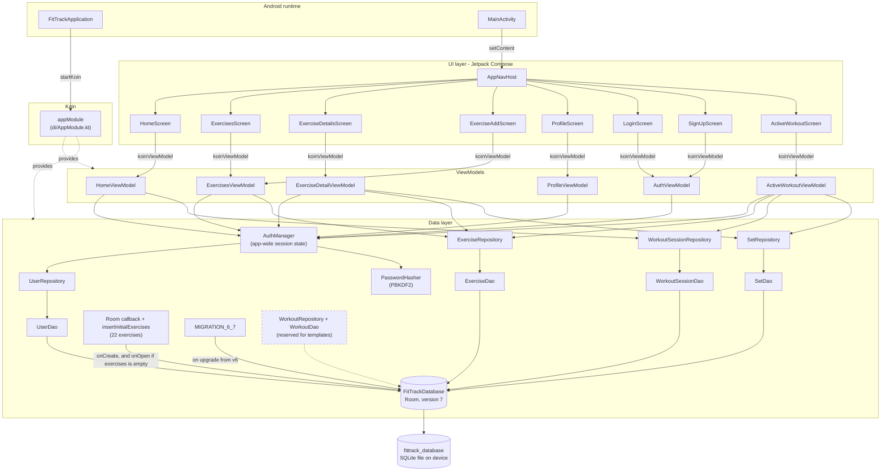
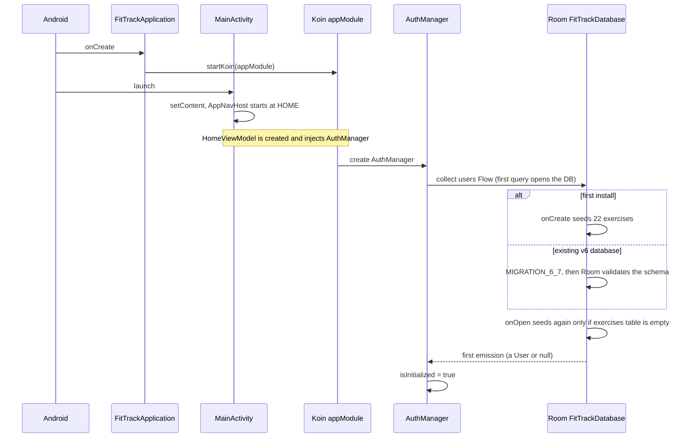
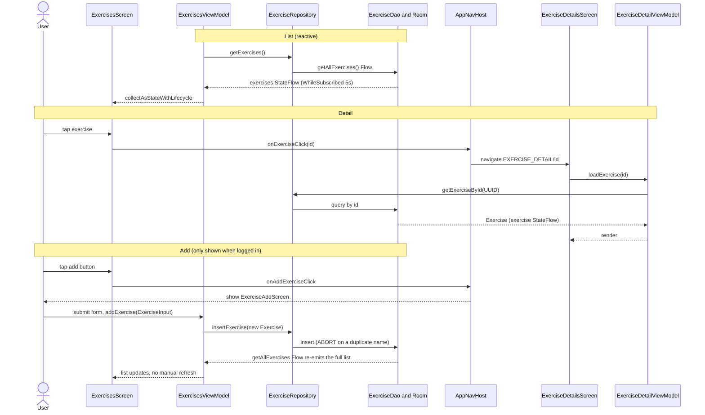
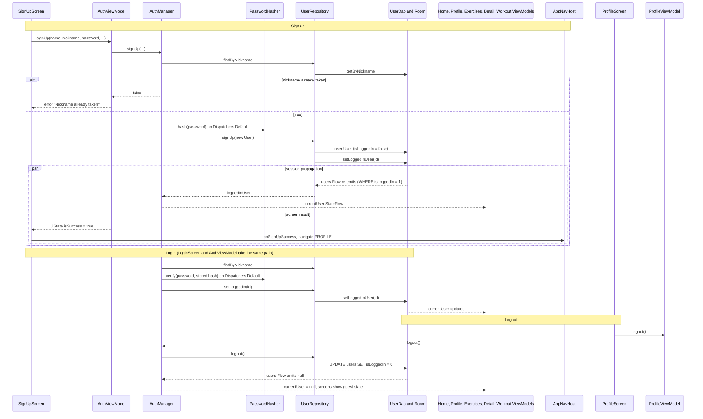
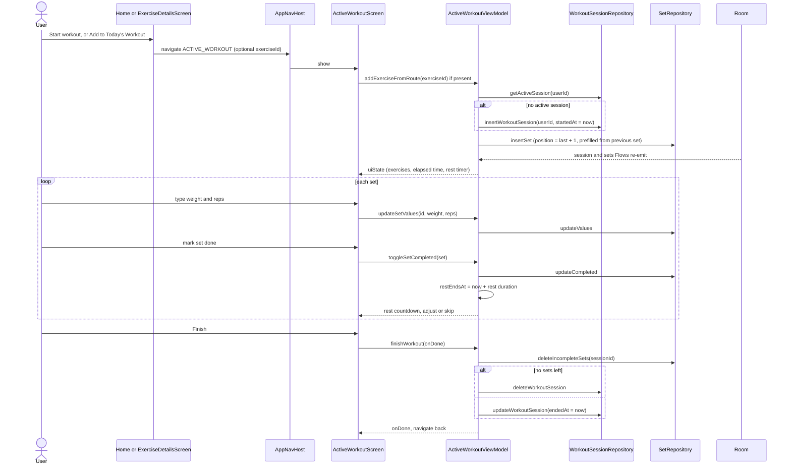
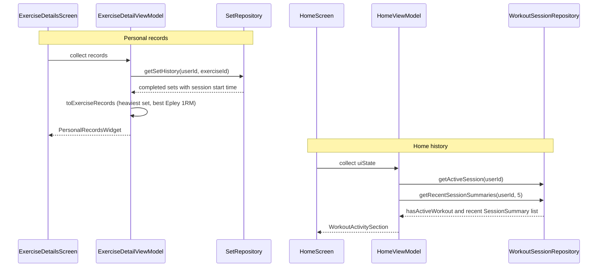

# FitTrack — Architecture Diagrams

Diagrams of the **current implementation**. Companion to [`ARCHITECTURE.md`](ARCHITECTURE.md), which
holds the details and known limitations. Written in [Mermaid](https://mermaid.js.org/) — renders on
GitHub and in Android Studio's Markdown preview.

**External services:** none. The app is fully offline (no network libraries, no `uses-permission` in
the manifest). The only persistent store is the on-device SQLite file managed by Room.

---

## 1. Components

Solid arrows are call/dependency direction (screen → ViewModel → repository → DAO). Data travels
back up as `Flow` / `StateFlow`. Dashed nodes exist in code but have **no consumer**.

Notes:
- `ExercisesViewModel` serves two screens (list and add). Each screen gets its own instance (scoped to
  its navigation entry), so they stay in sync through the Room `Flow`, not through shared VM state.
- Screens never reach repositories or DAOs directly.
- `ActiveWorkoutScreen` is reached from Home (no argument) and from the exercise detail screen
  (`?exerciseId=`). Both routes use the same destination.

---

## 2. Data flows

### 2.1 Cold start, seeding and migration

### 2.2 Exercises: list, detail, add

A duplicate name makes the insert throw; the ViewModel swallows it, so the user sees nothing happen.

### 2.3 Authentication and session propagation

The account and its workout history are kept on logout. The session is the `isLoggedIn` flag on the
user row.

### 2.4 Logging a workout

The elapsed time is derived from the stored `startedAt` on a 1 s ticker, so an in-progress workout
survives process death. Only the rest timer is in-memory.

### 2.5 Personal records and history

---

## 3. Not in the diagrams (exists in code, unused)

- `Workout` entity, `WorkoutDao` and `WorkoutRepository`: registered in Koin, no ViewModel or screen uses
  them (shown dashed in §1). Reserved for workout templates, which are not implemented.
- `AuthManager.isLoggedIn`: no reader outside `AuthManager` itself.
- The Analytics bottom-nav item is commented out (`FitTrackBottomNav.kt:28`); there is no analytics
  route in `AppNavHost`.
- Profile statistics are still hardcoded placeholders, although the data to compute them now exists.
