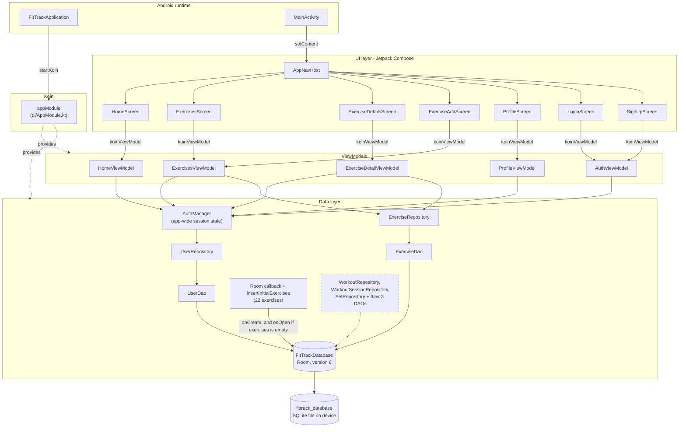
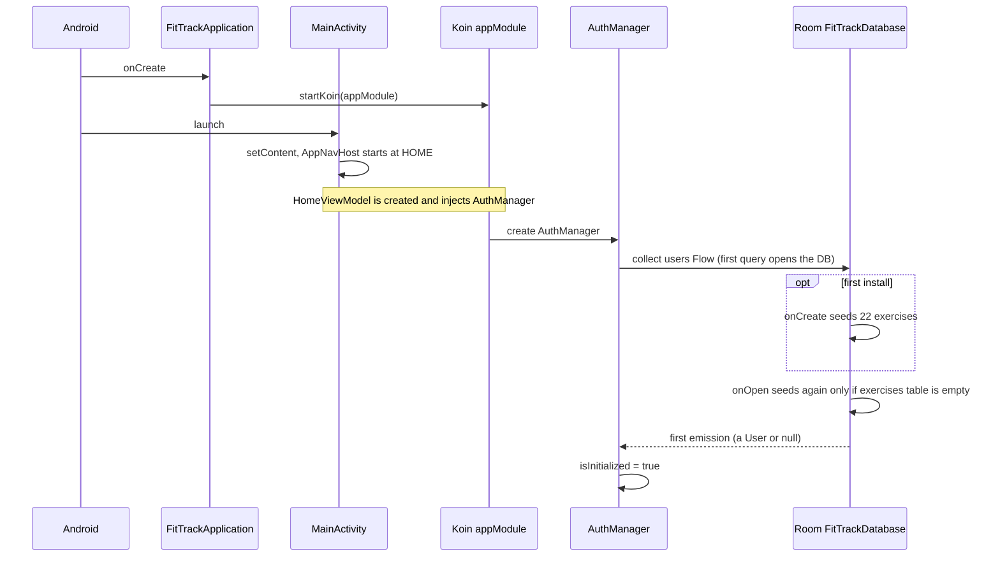
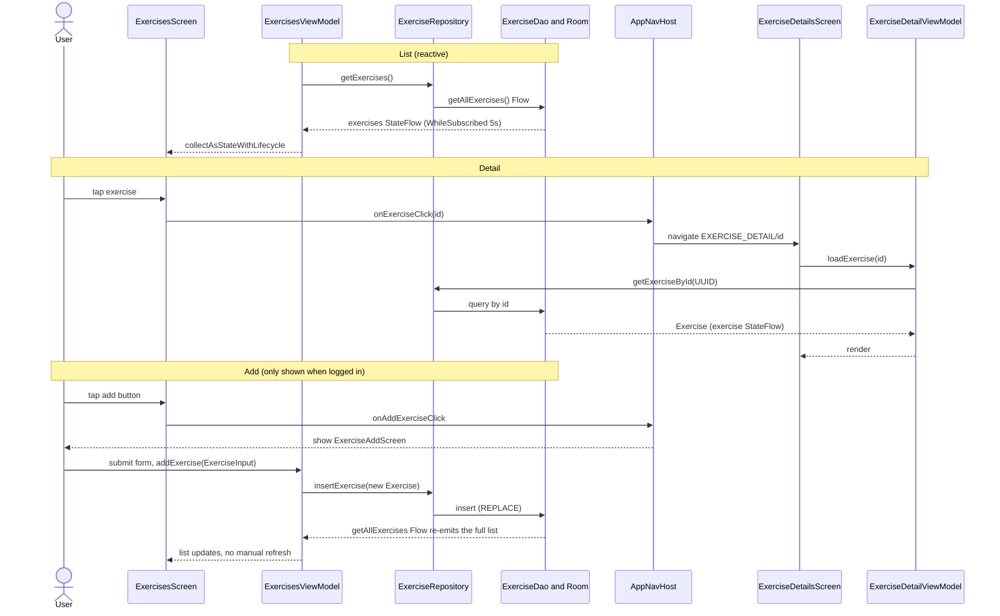
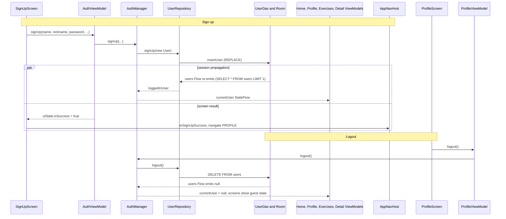

# FitTrack — Architecture Diagrams

Diagrams of the **current implementation**. Companion to [`ARCHITECTURE.md`](ARCHITECTURE.md), which
holds the details and known limitations. Written in [Mermaid](https://mermaid.js.org/) — renders on
GitHub and in Android Studio's Markdown preview.

**External services:** none. The app is fully offline (no network libraries, no `uses-permission` in
the manifest). The only persistent store is the on-device SQLite file managed by Room.

---

## 1. Components

Solid arrows are call/dependency direction (screen → ViewModel → repository → DAO). Data travels
back up as `Flow` / `StateFlow`. Dashed nodes exist in code but have **no consumer**.

Notes:
- `ExercisesViewModel` serves two screens (list and add). Each screen gets its own instance (scoped to
  its navigation entry), so they stay in sync through the Room `Flow`, not through shared VM state.
- Screens never reach repositories or DAOs directly.

---

## 2. Data flows

### 2.1 Cold start and seeding

### 2.2 Exercises: list, detail, add

### 2.3 Authentication and session propagation

Known issue visible in this flow: the `users` table is both the account store and the session marker,
so logout deletes the account, and `LoginScreen` can only be reached while the table is empty (where
`login()` always fails). See *Authentication is structurally incomplete* in `ARCHITECTURE.md` §8.

---

## 3. Not in the diagrams (exists in code, unused)

- `Workout`, `WorkoutSession`, `WorkoutSet` entities, their DAOs and repositories: registered in Koin,
  no ViewModel or screen uses them (shown dashed in §1).
- `AuthManager.isLoggedIn`: no reader outside `AuthManager` itself.
- The Analytics bottom-nav item is commented out (`FitTrackBottomNav.kt:28`); there is no analytics
  route in `AppNavHost`.
